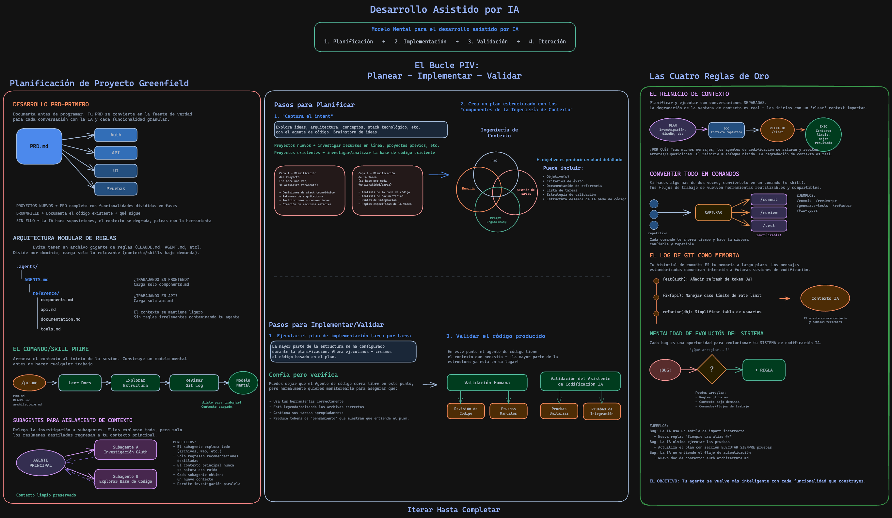
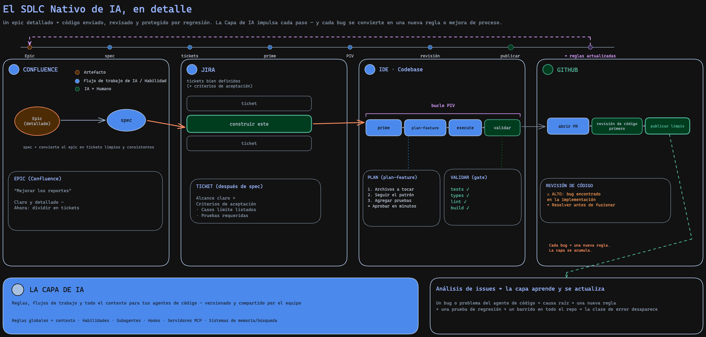
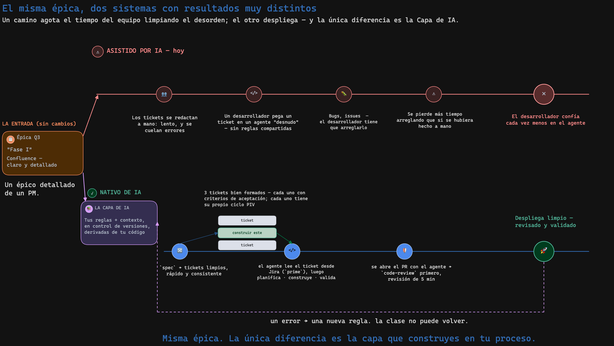
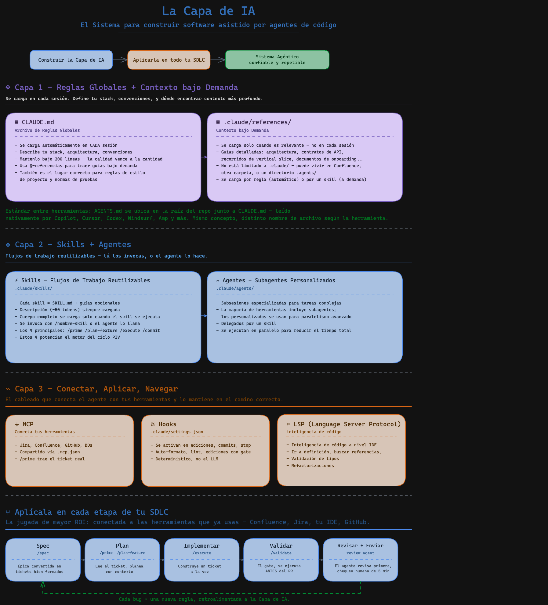

# AI Native Foundation Layer

The reusable **AI Layer** for agentic engineering - the skills, agents, and reference
docs you install **once** into any codebase.

## Install

```bash
# 1. Clone
git clone git@github.com:davoshack/ai-native-foundation-layer.git

# 2. Copy the AI Layer into your project (skills/agents/references + the Atlassian .mcp.json)
cp -r ai-native-foundation-layer/.claude <your-repo>/.claude
cp ai-native-foundation-layer/.mcp.json <your-repo>/.mcp.json
```

## Terminals

- [Herdr](https://herdr.dev/) — the runtime coding agents run on
- [tmux](https://tmux.app/) — the terminal multiplexer
- [cmux](https://cmux.com/) — the terminal built for multitasking

## Anthropic AI Native SDLC Playbook

- [The AI-Native SDLC playbook](https://claude.com/blog/the-ai-native-sdlc-playbook)

## Skills libraries

- [addyosmani/agent-skills](https://github.com/addyosmani/agent-skills) — production-grade engineering skills for AI coding agents
- [mattpocock/skills](https://github.com/mattpocock/skills) — skills for real engineers

## Spec-based libraries

- [bmad-method](https://github.com/bmad-code-org/bmad-method) — Breakthrough Method for Agile AI-Driven Development
- [superpowers](https://github.com/obra/superpowers) — an agentic skills framework and software development methodology
- [OpenSpec](https://github.com/Fission-AI/openspec) — spec-driven development for AI coding assistants
- [spec-kit](https://github.com/github/spec-kit) — toolkit to get started with spec-driven development

## Engineering Articles

- [Agentic Harness Engineering](https://www.decodingai.com/p/agentic-harness-engineering) — LLMs as the new OS
- [Harness engineering for coding agent users](https://martinfowler.com/articles/harness-engineering.html)
- [Agentic AI Engineering Guide: 6 Critical Mistakes](https://www.decodingai.com/p/agentic-ai-engineering-guide-6-mistakes?utm_source=publication-search)
- [Agentic Programming](https://martinfowler.com/bliki/AgenticProgramming.html)
- [Brownfield Agentic Engineering](https://addyo.substack.com/p/brownfield-agentic-engineering?utm_source=profile&utm_medium=reader2)
- [Agentic Code Quality](https://addyo.substack.com/p/agentic-code-quality?utm_source=profile&utm_medium=reader2)
- [Practical Loop Engineering](https://addyo.substack.com/p/practical-loop-engineering?utm_source=profile&utm_medium=reader2)
- [The New Software Lifecycle](https://oreillyradar.substack.com/p/the-new-software-lifecycle?utm_source=profile&utm_medium=reader2)

## AI Layer








